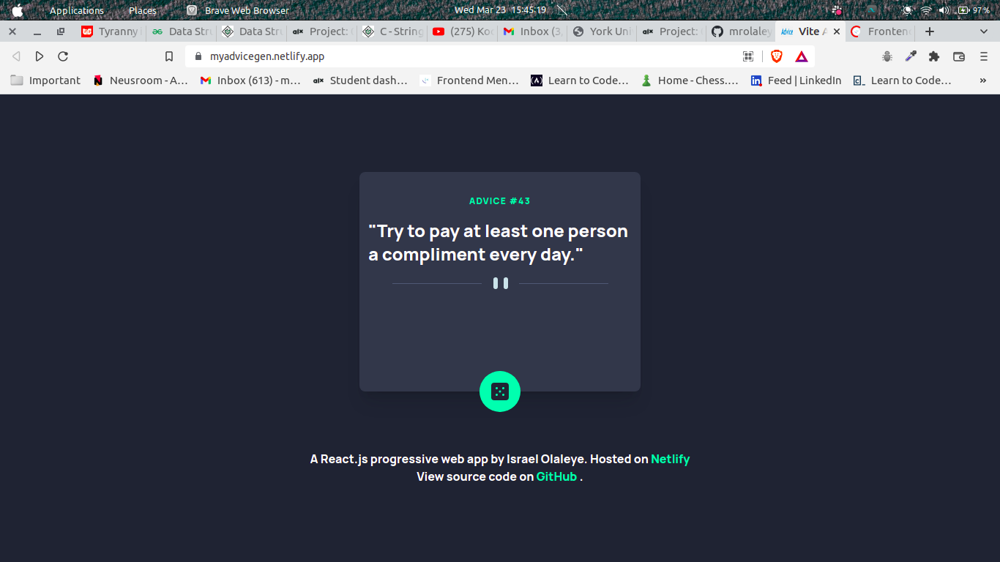

# Frontend Mentor - Advice generator app solution

This is a solution to the [Advice generator app challenge on Frontend Mentor](https://www.frontendmentor.io/challenges/advice-generator-app-QdUG-13db). Frontend Mentor challenges help you improve your coding skills by building realistic projects.

## Table of contents

- [Overview](#overview)
  - [The challenge](#the-challenge)
  - [Screenshot](#screenshot)
  - [Links](#links)
- [My process](#my-process)
  - [Built with](#built-with)
  - [What I learned](#what-i-learned)
  - [Continued development](#continued-development)
  - [Useful resources](#useful-resources)
- [Author](#author)
- [Acknowledgments](#acknowledgments)

## Overview

### The challenge

Users should be able to:

- 

### Screenshot

### Links

- Solution URL: [Add solution URL here](https://myadvicegen.netlify.app)
- Live Site URL: [Add live site URL here](https://myadvicegen.netlify.app/)

### Built with

- Semantic HTML5 markup
- Tailwind CSS
- Flexbox
- CSS Grid
- Mobile-first workflow
- [React](https://reactjs.org/) - JS library
- [Vitejs.dev](https://vitejs.dev/) - FrontEnd Tooling
- [Tailwind CSS](https://tailwindcss.com/) - For styles

### What I learned

I learnt how to fetch API.

## Author

- Website - [Israel Olaleye](https://github.com/mrolaleyeisrael)
- Frontend Mentor - [@mrolaleyeisrael](https://www.frontendmentor.io/profile/mrolaleyeisrael)
- Twitter - [@mrolaleyeisrael](https://twitter.com/mrolaleyeisrael)
